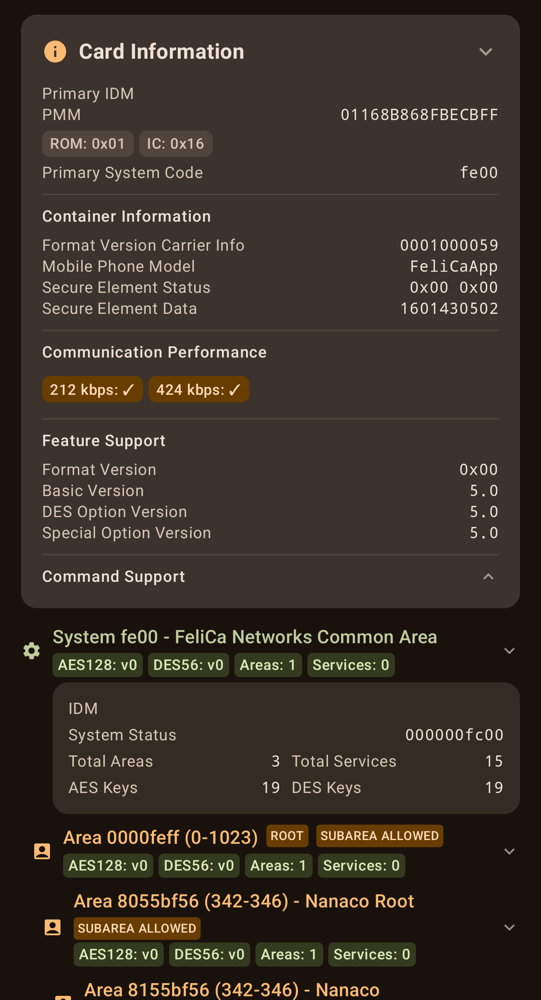

# FeliCa Tool

<p float="left">
  
  
  
  
</p>


# Overview

This project implements tools for performing deep analysis of FeliCa card capabilities and the extraction of available data.

This application enables users to:
* Extract information about FeliCa cards, including:
  * Card identification (IDM, PMM);
  * System codes and services;
  * Block information and data;
  * Card capabilities.
* View detailed scan progress with step-by-step execution timings;
* View scan results, with information assembled from performed commands:
  * General information;
  * Command support report;
  * Enumeration of the detected service providers;
  * Per-system hierarchy overview:
    * Count of child nodes;
    * Key versions and types;
    * Auxiliary node properties;
    * Other node attributes;
    * Block data;
    * Related node annotation (names, service providers, etc).


# Requirements

* Android Studio;
* An Android device with NFC hardware and Android API level 31 or higher (Android 12);
* FeliCa targets to scan (transportation cards, mobile wallet passes, etc.).


# Usage

* Build and install the application to your device using Android Studio;
* Enable NFC on your Android device if not already enabled;
* Open the FeliCa Tool application;
* Place a FeliCa card near the device's NFC antenna;
* The application will automatically detect the card and begin the scanning process;
* Monitor the scan progress through the step-by-step interface;
* View detailed results by expanding individual steps or accessing the scan overview;
* Remove the card when scanning is complete.


# Project Structure

* `felica` - Core FeliCa protocol implementation containing:
  * Protocol models and entities;
  * Command classes validators & parsers;
  * Response classes validators & parsers;
  * Protocol constants and enumerations.
* `service` - Application business logic (scanning, analysis);
* `ui` - User interface components;
* `util` - Helper functions and extensions for data processing.


# Supported FeliCa Commands

At the current moment, "analysis" mode of the application attempts to detect support for the following commands:

| Command                                   | Command Code | IDM on Command | 0x00 (RC-S830) | 0x01 (RC-S915) | 0x0B (RC-S953/?) | 0x20 (RC-S962) | 0x24 (China, Hong Kong) | 0x31 (RC-S114) | 0x32 (RC-SA00/1) | 0x36 (RC-SA04/1) | 0x38    | 0x3B    | 0x44 (RC-SA20/1) | 0x16 (Mobile FeliCa 4.0 for Apple Wallet) | 0x18 (Mobile FeliCa 4.1) | 0xF1 (RC-S966 FeliCa Lite-S) | Notes                                                                                     |
|-------------------------------------------|--------------|----------------|----------------|----------------|------------------|----------------|-------------------------|----------------|------------------|------------------|---------|---------|------------------|-------------------------------------------|--------------------------|------------------------------|-------------------------------------------------------------------------------------------|
| Polling                                   | `00`         | ✗              | ✓              | ✓              | ✓                | ✓              | ✓                       | ✓              | ✓                | ✓                | ✓       | ✓       | ✓                | ✓                                         | ✓                        | ✓                            | Reading card IDM and PMM data                                                             |
| Polling (System Code)                     | `00`         | ✗              | ✓              | ✓              | ✓                | ✓              | ✓                       | ✓              | ✓                | ✓                | ✓       | ✓       | ✓                | ✓                                         | ✓                        | ✓                            | Request primary system code of the card using polling command                             |
| Polling (Communication Performance)       | `00`         | ✗              | ✗              | ✗              | ✓                | ✓              | ✓                       | ✓              | ✓                | ✓                | ✓       | ✓       | ✓                | ✓                                         | ✓                        | ✓                            | Request information about supported communication speeds using polling command            |
| Request Service                           | `02`         | ✓              | ✓              | ✓              | ✓                | ✓              | ✓                       | ✓              | ✓                | ✓                | ✓       | ✓       | ✓                | ✓                                         | ✓                        | ✗                            | Request key versions for given nodes                                                      |
| Request Response                          | `04`         | ✓              | ✓              | ✓              | ✓                | ✓              | ✓                       | ✓              | ✓                | ✓                | ✓       | ✓       | ✓                | ✓                                         | ✓                        | ✗                            | Request response from the card                                                            |
| Read Without Encryption                   | `06`         | ✓              | ✓              | ✓              | ✓                | ✓              | ✓                       | ✓              | ✓                | ✓                | ✓       | ✓       | ✓                | ✓                                         | ✓                        | ✓                            | Read block data from services that don't require authentication                           |
| Search Service Code                       | `0A`         | ✓              | ✓              | ✓              | ✓                | ✓              | ✗                       | ✓              | ✓                | ✓                | ✓       | ✓       | ✓                | ✓                                         | ✓                        | ✗                            | Request node registered in the system iteratively                                         |
| Request System Code                       | `0C`         | ✓              | ✓              | ✓              | ✓                | ✓              | ✓                       | ✓              | ✓                | ✓                | ✓       | ✓       | ✓                | ✓                                         | ✓                        | ✗                            | Request all system codes registered to the card                                           |
| Request Block Information                 | `0E`         | ✓              | ✗              | ✗              | ✗                | ✗              | ✗                       | ✗              | ✗                | ✗                | ✗       | ✗       | ✗                | ✗                                         | ✓                        | ✗                            | Request the amount of blocks assigned to nodes                                            |
| Request Block Information Ex              | `1E`         | ✓              | ✗              | ✗              | ✗                | ✗              | ✗                       | ✗              | ✗                | ✗                | ✗       | ✗       | ✗                | ✗                                         | ✓                        | ✗                            | Request the amount of allocated and free blocks for nodes                                 |
| Request Code List                         | `1A`         | ✓              | ✗              | ✗              | ✗                | ✗              | ✗                       | ✗              | ✗                | ✗                | ✗       | ✗       | ✗                | ✗                                         | ✓                        | ✗                            | Request a list of nodes for a given root node iteratively                                 |
| Set Parameter                             | `20`         | ✓              | ✗              | ✗              | ✗                | ✗              | ✗                       | ✗              | ✗                | ✗                | ✗       | ✗       | ✗                | ✗                                         | ✓                        | ✗                            | Set card communication parameters (encryption type and node code size)                    |
| Get Container Issue Information           | `22`         | ✓              | ✗              | ✗              | ✗                | ✗              | ✗                       | ✗              | ✗                | ✗                | ✗       | ✗       | ✗                | ✓                                         | ✓                        | ✗                            | Get container-specific information including format version and mobile phone model        |
| Get Area Information                      | `24`         | ✓              | ✗              | ✗              | ✗                | ✗              | ✗                       | ✗              | ✗                | ✗                | ✗       | ✗       | ✗                | ✗                                         | ✓                        | ✗                            | Get information about a specific area **(Official name and exact purpose are not known)** |
| Get Container Property                    | `2E`         | ✓              | ✗              | ✗              | ✗                | ✗              | ✗                       | ✗              | ✗                | ✗                | ✗       | ✗       | ✗                | ✗                                         | ✓                        | ✗                            | Get container property data by index **(Official name and exact purpose are not known)**  |
| Get Node Property (Value Limited Service) | `28`         | ✓              | ✗              | ✗              | ✗                | ✗              | ✗                       | ✗              | ✗                | ✗                | ✗       | ✓       | ✓                | ✗                                         | ✗                        | ✗                            | Get value-limited purse service properties for nodes                                      |
| Get Node Property (MAC Communication)     | `28`         | ✓              | ✗              | ✗              | ✗                | ✗              | ✗                       | ✗              | ✗                | ✗                | ✗       | ✓       | ✓                | ✗                                         | ✗                        | ✗                            | Get MAC communication properties for nodes                                                |
| Request Service V2                        | `32`         | ✓              | ✗              | ✗              | ✗                | ✗              | ✗                       | ✓              | ✓                | ✓                | ✓       | ✓       | ✓                | ✓                                         | ✓                        | ✗                            | Request AES and DES key versions for nodes alongside the key type identifier              |
| Get System Status                         | `38`         | ✓              | ✗              | ✗              | ✗                | ✗              | ✗                       | ✓              | ✓                | ✓                | ✓       | ✓       | ✓                | ✓                                         | ✓                        | ✗                            | Get current system status information from the card                                       |
| Get Platform Information                  | `3A`         | ✓              | ✗              | ✗              | ✗                | ✗              | ✗                       | ✓              | ✓                | ✓                | ✓       | ✓       | ✓                | ✓                                         | ✓                        | ✗                            | Get platform information from the card. **(Official name is not known)**                  |
| Request Specification Version             | `3C`         | ✓              | ✗              | ✗              | ✗                | ✗              | ✗                       | ✓              | ✓                | ✓                | ✓       | ✓       | ✓                | ✓                                         | ✓                        | ✗                            | Get card feature version and supported option versions                                    |
| Reset Mode                                | `3E`         | ✓              | ✗              | ✗              | ✗                | ✗              | ✗                       | ✓              | ✓                | ✓                | ✓       | ✓       | ✓                | ✓                                         | ✓                        | ✗                            | Reset card mode to Mode0                                                                  |
| Get Container ID                          | `70`         | ✗              | ✗              | ✗              | ✗                | ✗              | ✗                       | ✗              | ✗                | ✗                | ✗       | ✗       | ✗                | ✗                                         | ✓                        | ✗                            | Get container IDM from mobile FeliCa targets                                              |
| Authentication1 (DES)                     | `10`         | ✓              | ✓              | ✓              | ✓                | ✓              | ✓                       | ✓              | ✓                | ✓                | ✓       | ✓       | ✓                | ✓                                         | ✓                        | ✗                            | Start DES-based mutual authentication                                                     |
| Authentication1 (AES)                     | `40`         | ✓              | ✗              | ✗              | ✗                | ✗              | ✗                       | ✓              | ✓                | ✓                | ✓       | ✓       | ✓                | ✓                                         | ✓                        | ✗                            | Start AES-based mutual authentication                                                     |
| Echo                                      | `F000`       | ✗              | ✗              | ✓ (252)        | ✓ (252)          | ✓ (238)        | ✗                       | ✓ (252)        | ✓ (252)          | ✓ (252)          | ✓ (252) | ✓ (252) | ✓ (252)          | ✓ (252)                                   | ✓ (252)                  | ✓ (75)                       | Test communication with the card                                                          |


**Note:** If you have tested this application with other FeliCa card types or targets and would like to contribute your results, we would gladly add them to this compatibility table. Please share your findings by opening an issue or submitting a pull request with the command support details for your specific card type.


# Testing

Most models used in the project have comprehensive data parsing tests.

Run tests using:
```bash
./gradlew :app:testDebugUnitTest --info
```


# Building

Build and install the debug version:
```bash
./gradlew :app:installDebug
```


# Improvements

* Improve annotation of known system, area codes, and IC types;
* Improve/refactor the UI part of the project.
* Add testing for some more commands with unknown meaning;
* Add support for FALP commands (need hardware to test on);
* Implement support for DES authentication commands (WIP, waiting for an ability to properly test Authentication2);
* Support external readers (PN532, PCSC);
* Add desktop (macOS, Linux, Windows) support by moving over to Compose Multiplatform;
* Add root-related functionality:
  * An ability to emulate a FeliCa standard card;
  * Support for commands with two-byte codes, some of which may only be available on wired interface, while talking to the embedded Osaifu-Keitai applet or chip.


# Known Issues

* Some tags may have partial block reading results due to an undiagnosed issue - waiting for test samples or user logs to help resolve this.


# Contributing

In case you've encountered an issue, or would like to help improving this project, please feel free to open an issue or submit a pull request.

For command compatibility results, include details about your specific card type and which commands work or don't work. Feel free to comment out the unique part of the IDM (bytes 3-6, zero-indexed), or the block data, if that makes you more comfortable to do so.


# Notes

* This application is intended for educational and analysis purposes;
* FeliCa is a registered trademark of Sony Corporation.


# References

* Documentation:
  * FeliCa card user's manual (Excerpted edition) - basic command reference, IDM, PMM, timeout meaning;
  * FeliCa lite s user's manual - specifics of FeliCa lite tags (systems, services).

* Online Resources:
  * [Android NFC Documentation](https://developer.android.com/guide/topics/connectivity/nfc) - information on implementing NfcF tag reading in android;
  * [NUllableVoidPtr - NFCFInfo](https://nullablevoidptr.github.io/nfcf-info/) - list of command codes, system codes, and references to other resources;
  * [Metrodroid FeliCa Wiki](https://github.com/metrodroid/metrodroid/wiki/FeliCa) - system codes;
  * [OnakaSuita Wiki - FeliCa Commands](https://wiki.onakasuita.org/pukiwiki/?FeliCa%2Fコマンド) - command codes;
  * [Oliet - oliet.hatenablog.jp](https://oliet.hatenablog.jp/), [blog.oliet.tech](https://blog.oliet.tech) (removed) - insights into the operation of FeliCa protocol.
  
* Existing Projects:
  * [nfcpy - Sony FeliCa implementation](https://github.com/nfcpy/nfcpy/blob/v1.0.4/src/nfc/tag/tt3_sony.py) - timeout calculation, service codes;
  * [TRETJapanNFCReader](https://github.com/treastrain/TRETJapanNFCReader) - system codes and commands;
  * [felica-dumper](https://github.com/soltia48/felica-dumper) - upcoming implementation of Authentication commands;
  * HCE-F-Unlocker (removed) - example of an Xposed module to remove HCE-F system code limitation;

* Analyzed applications:
  * Osaifu-Keitai stack version 2.2 - source of some of the discovered commands.


# License

This project is licensed under the Apache License 2.0 - see the [LICENSE](LICENSE) file for details.
